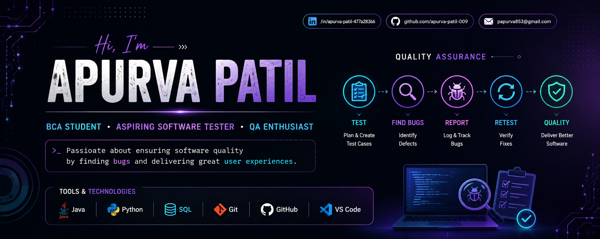

  

## 👩‍💻 About Me

🎓 BCA Student  
🧪 Aspiring Software Tester & QA Engineer  
🔍 Interested in Manual Testing, Test Case Design & Bug Reporting  
💻 Learning Automation Testing and SQL  
📚 Improving my programming and problem-solving skills  
🚀 Looking for opportunities to learn, grow and contribute  

### 🎯 My Goal

To start my career in **Software Testing / Quality Assurance** and become a skilled QA professional by continuously learning and working on real-world projects.

<h2>🛠️ Skills & Tech Stack</h2>

<h3>💻 Programming</h3>

  
  
  

<h3>🧪 Software Testing</h3>

  
  
  
  
  

<h3>🔧 Tools & Technologies</h3>

  
  
  

<h3>📚 Currently Learning</h3>

  
  

## 🚀 Featured Projects

### 🧪 E-Commerce Manual Testing Project

A complete manual testing project demonstrating the Software Testing Life Cycle from test planning to final reporting.

**📊 Project Results**

| Metric | Result |
|---|---:|
| 🧪 Test Cases | 29 |
| ✅ Passed | 24 |
| ❌ Failed | 4 |
| ⚠️ Blocked | 1 |
| 🐞 Defects Found | 4 |
| 📈 Pass Rate | 82.76% |

**🔍 Testing Covered**

- Test Planning
- Test Scenario Design
- Test Case Design
- Functional Testing
- Manual Test Execution
- Bug Reporting
- Regression Testing
- Retesting
- Test Summary Reporting

👉 **[View E-Commerce Testing Project](https://github.com/apurva-patil-009/ecommerce-testing-project)**

---

### ☕ Java Programming Practice

A collection of Java programs created while learning programming fundamentals and Java concepts.

**Topics include:**

- OOP Concepts
- Collections
- Exception Handling
- Loops & Conditions
- Arrays
- Basic Problem Solving

👉 **[View Java Projects](https://github.com/apurva-patil-009)**

---

### 🐍 Python Programming Practice

Python programs covering programming fundamentals and problem-solving.

**Topics include:**

- Lists
- Functions
- Loops
- Conditional Statements
- Number Programs
- Basic Problem Solving

👉 **[View Python Projects](https://github.com/apurva-patil-009)**

<h2>🔥 GitHub Contribution Streak</h2>

  

<h2>🎓 Education</h2>

  
  

  Currently pursuing Bachelor of Computer Applications (BCA)

<h2>🎯 Career Goal</h2>

  

  My goal is to build a career in <strong>Software Testing and Quality Assurance</strong>,
  gain real-world experience, and contribute to building reliable and high-quality software.

<h2>📚 Currently Learning</h2>

  
  
  
  

<ul>
  <li>🤖 Automation Testing</li>
  <li>🌐 Selenium WebDriver</li>
  <li>🔌 API Testing</li>
  <li>🗄️ Advanced SQL</li>
  <li>🧪 Advanced QA Practices</li>
</ul>

<h2>🧪 My QA Testing Workflow</h2>

📝 <strong>Requirement Analysis</strong>
&nbsp; → &nbsp;
📋 <strong>Test Planning</strong>
&nbsp; → &nbsp;
🧪 <strong>Test Case Design</strong>
&nbsp; → &nbsp;
▶️ <strong>Test Execution</strong>
&nbsp; → &nbsp;
🐞 <strong>Bug Reporting</strong>
&nbsp; → &nbsp;
🔄 <strong>Retesting</strong>
&nbsp; → &nbsp;
🔍 <strong>Regression Testing</strong>
&nbsp; → &nbsp;
✅ <strong>Release</strong>

  <em>"Quality is not an act, it is a habit."</em>

<h2>💡 What I Like Working On</h2>

<table align="center">
<tr>
<td width="50%">

### 🧪 Software Testing

- Manual Testing
- Functional Testing
- Regression Testing
- Retesting
- Test Case Design
- Bug Reporting

</td>

<td width="50%">

### 💻 Programming

- Java
- Python
- SQL
- Problem Solving
- Git & GitHub
- Learning Automation

</td>
</tr>
</table>

<h2>🏆 QA Project Achievement</h2>

  
  
  
  
  

<strong>82.76% Test Pass Rate</strong>

  

<h2>📫 Let's Connect</h2>

  💼 Open to Software Testing / QA Internship Opportunities

<h3 align="center">
  ⭐ Thanks for visiting my profile! ⭐
</h3>

  

